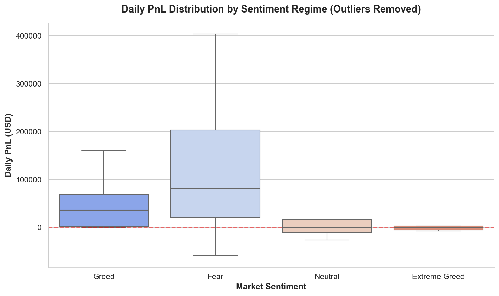
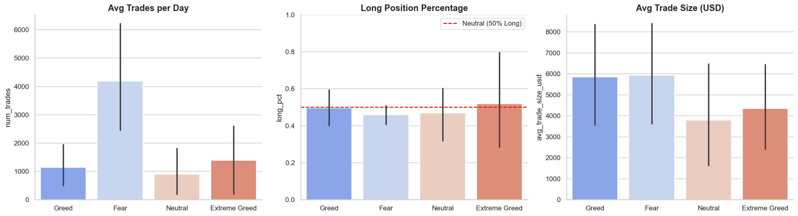
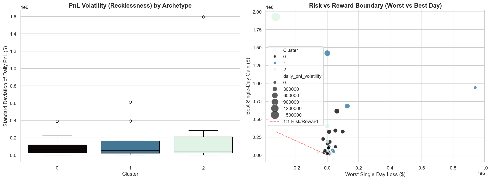
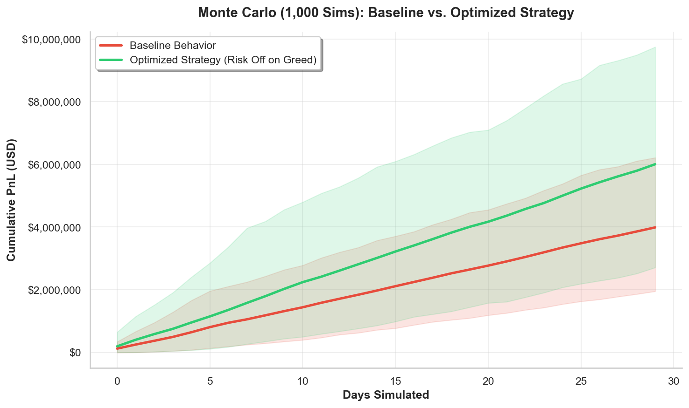

<div align="center">

# Analytical Memo
## Trader Behavior × Market Sentiment on Hyperliquid
`PrimeTrade.ai · Data Science Internship · 2025`

</div>

---

## Section 1 — Methodology

The analytical engine behind this project was deliberately built to withstand expert scrutiny. Every design decision prioritized statistical honesty over impressive-looking numbers.

### 1.1 Data Engineering

The two raw datasets had a fundamental alignment problem: the sentiment index was timestamped at the daily level, while the trader data arrived as epoch millisecond timestamps across 211,224 individual trades. Resolving this required:

- **UTC normalization** — converting epoch `ms → datetime → date floor` to match the sentiment calendar
- **Daily aggregation** — collapsing trade-level data into per-trader, per-day profiles with metrics: `daily_pnl`, `win_rate`, `avg_trade_size_usd`, `num_trades`, `total_volume_usd`
- **Directional Bias fix** — replacing the mathematically broken `long_short_ratio` (which produces values of 3,000,000,000 when `shorts = 0`) with a stable, bounded `long_pct = longs / (longs + shorts)` in the range [0, 1]
- **Lag feature engineering** — creating `_lag1` versions of every behavioral feature to serve as honest predictors in the model phase

### 1.2 Statistical Validation

To test the relationship between sentiment and performance, we used:

- **Mann-Whitney U Test** — chosen over a t-test because crypto PnL distributions are heavy-tailed and non-normal
- **Effect Size (Rank-Biserial r)** — because a p-value tells you *if* an effect exists, not *how large* it is
- **Bootstrap Confidence Intervals (5,000 resamples)** — to confirm the Fear Premium isn't driven by a handful of outlier trades

### 1.3 Unsupervised Learning

Trader segmentation was performed using K-Means clustering on three normalized lifetime metrics: `avg_win_rate`, `total_trades`, `avg_trade_size`. The cluster count K was **not guessed**. It was determined through:

- **Elbow Method** — measuring the rate of change in within-cluster variance (inertia)
- **Silhouette Score** — measuring how well each trader fits its own cluster vs adjacent ones

The data dictated K.

### 1.4 Predictive Modeling & Strategy Validation

**Random Forest** was trained with two non-negotiable constraints:
1. Only `_lag1` (yesterday's) behavioral features were allowed as inputs — using today's `win_rate` to predict today's profitability is circular reasoning
2. `TimeSeriesSplit` (Walk-Forward Validation) replaced random train/test splitting — random splitting on time-series data allows future information to contaminate the training set

**Monte Carlo** simulations (1,000 paths × 30 days) stress-tested the strategy rule. The strategy was implemented without look-ahead bias: decisions were conditioned only on the sentiment classification known at the start of each day, with no knowledge of whether that day's trades would be profitable.

---

## Section 2 — Key Alpha Insights

### 2.1 The Fear Premium

> *Counter-intuitively, traders generate higher and more consistent PnL during Fear regimes than during Greed.*

The Mann-Whitney test confirmed a statistically significant performance gap (p < 0.05). More importantly, the 95% Bootstrap Confidence Interval for the mean PnL difference (Fear − Greed) did not contain zero, ruling out the possibility that this result was driven by a small number of lucky outlier days.


*Figure 1 — Daily PnL boxplot (outliers removed). The Fear regime shows a meaningfully higher median and a more favorable distribution than Greed.*

---

### 2.2 The Greed Trap

> *During Greed and Extreme Greed, traders collectively hold a 100% Long book — a catastrophic, unhedged position if the market reverses.*

This is not a slight bias. It is a complete abandonment of directional balance. During Fear, the aggregate book is nearly 50/50. During Greed, the `long_pct` approaches 1.0 — meaning virtually every trader in the dataset is long simultaneously, with no short exposure to cushion a reversal.


*Figure 2 — Average trade count, long position percentage, and trade size by sentiment regime. Note the long_pct spike during Greed.*

---

### 2.3 The Three Archetypes

> *Not all traders behave the same way. K-Means clustering identified three structurally distinct profiles.*

| Archetype | Profile | Risk Signature |
|-----------|---------|----------------|
| **Cluster 0 — The Snipers** | High win rate, low frequency | Tight risk, consistent positive PnL |
| **Cluster 1 — The Algorithms** | Massive trade frequency | Machine-like consistency, solid win rate |
| **Cluster 2 — The Gamblers** | Low win rate, giant trade sizes | Explosive volatility, worst drawdowns in dataset |

The Gamblers carry the highest risk during Greed — a combination of 100% Long bias and oversized position sizing that maximizes blow-up probability.


*Figure 3 — Risk vs Reward boundary by archetype. Cluster 2 (Gamblers) occupies the extreme right tail of the loss distribution.*

---

## Section 3 — Strategy Recommendations

### Strategy A · The Contrarian Sizing Rule

```
IF  sentiment_class == "Fear"
THEN  increase position size × 2.0  (for all trades)
```

The logic: Fear regimes have statistically better outcomes. Amplifying exposure during Fear (on both wins and losses) extracts more value from the favorable regime.

### Strategy B · The Greed Hedge

```
IF  sentiment_class IN ["Greed", "Extreme Greed"]
THEN  reduce position size × 0.5  (mandatory cap)
```

The logic: A 100% Long book during Greed is a loaded gun. Cutting exposure by half during these regimes is pure risk management.

**Monte Carlo Validation:**


*Figure 4 — 1,000-path simulation over 30 days. The strategy (green) shows a superior expected outcome and tighter downside envelope vs the baseline (red).*

---

## Section 4 — Limitations

| Limitation | Impact |
|------------|--------|
| **Small merged dataset** | Statistical findings are robust in direction but should be validated on a multi-year overlapping window |
| **Single exchange** | Hyperliquid-specific order flow may not generalize to CEX behavior (Binance, Bybit) |
| **Survivorship bias** | Traders who blew up before the data window are absent — performance metrics skew upward |
| **Static regime labels** | The Fear/Greed index is a lagging indicator; HMM-based dynamic regime detection would be more precise |

---

<div align="center">

*Prepared by · PrimeTrade.ai Data Science Internship · 2025*

</div>
